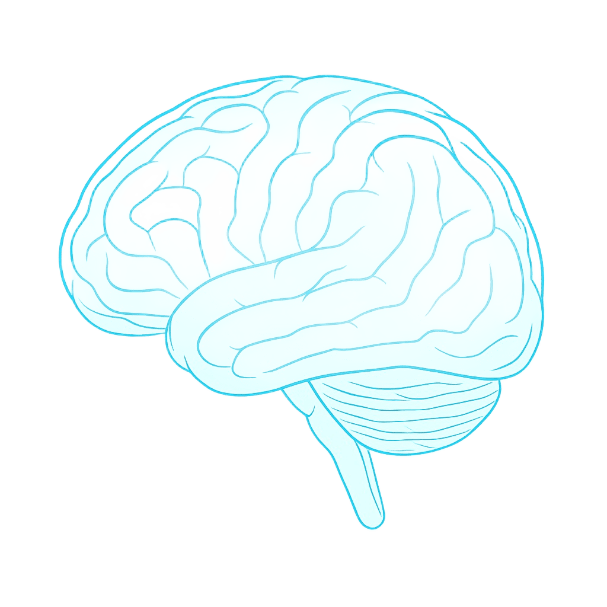
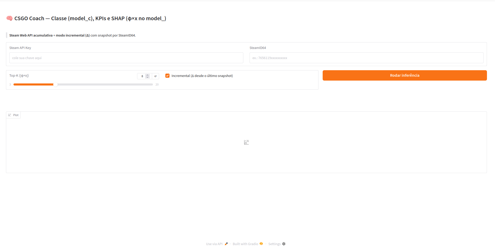
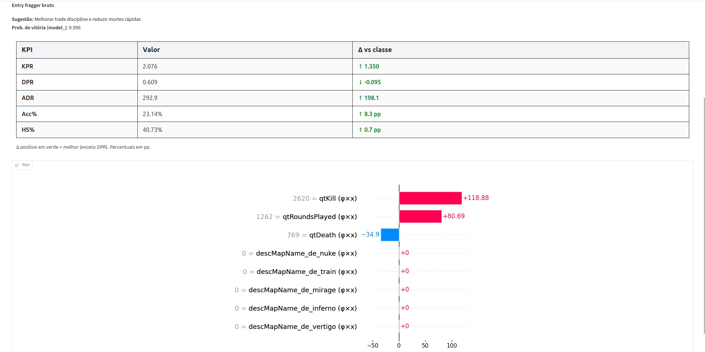

# CS2 Coach

  

---

## 📌 Sobre o Projeto

**CS2 Coach** é uma aplicação que combina **dados da Steam Web API** e **modelos de machine learning** para analisar estatísticas de jogadores de CS2.  
O sistema:

- Prevé a **probabilidade de vitória** do jogador.  
- Identifica **perfil ou estilo de jogo** com base em clusters de performance.  
- Gera **KPIs detalhados**, incluindo KPR, DPR, ADR, Headshot%, Accuracy% e sobrevivência por round.  
- Permite **análise incremental** (Δ) mostrando evolução desde o último snapshot.  
- Oferece **explicações interpretáveis** com SHAP, mostrando o impacto de cada estatística na previsão.

---

## 🎯 Objetivos

- Fornecer insights objetivos para jogadores e treinadores sobre **desempenho e estilo de jogo**.  
- Ajudar na **melhoria contínua** baseada em dados reais.  
- Disponibilizar uma ferramenta **interativa e interpretável**, com visualização de KPIs e análise de features.

---

## ✨ Funcionalidades

- **Previsão de vitória** com base em estatísticas acumuladas ou incrementais.  
- **Identificação de perfil/cluster do jogador** com sugestões personalizadas.  
- **KPIs detalhados**, comparando o jogador com a média do cluster.  
- **Visualização SHAP**, mostrando as features mais importantes para a previsão.  
- **Modo incremental (Δ)**: acompanha evolução desde a última execução.  
- **Cache de snapshots**: mantém histórico de estatísticas para cálculo do delta.

---

## 🛠️ Componentes do Sistema

- **Modelos de Machine Learning**: Keras para previsão de vitória e clusterização de perfil.  
- **API Steam**: coleta estatísticas do jogador a partir do SteamID64.  
- **Funções de processamento**: transformam dados brutos em input para os modelos.  
- **SHAP**: interpreta as previsões explicando a influência de cada feature.  
- **Interface Gradio**: interação fácil para visualização de resultados e gráficos.

---

## 🏠 Interface Interativa

O usuário fornece:

- **Steam API Key**  
- **SteamID64 do jogador**  
- **Top-K SHAP**  
- **Checkbox de modo incremental (Δ)**

### 🔹 Resultados exibidos

- **Perfil do jogador** e sugestões de melhoria.  
- **Probabilidade de vitória** na próxima partida.  
- **Tabela de KPIs** com comparação com a média do cluster.  
- **Gráfico SHAP** mostrando as estatísticas mais influentes.

> A interface oferece uma **visão completa do desempenho**, permitindo decisões estratégicas para evoluir no jogo.

---

## 📜 License

  

This project is licensed under the [Creative Commons Attribution-NonCommercial-ShareAlike 4.0 International License](LICENSE).
